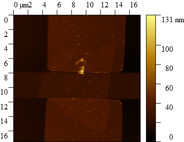

# Document summary

This is a document to codify the styling of the process flows for tracking experiments and devices. This document will  include a description and standards. These will change over time, but will hopefully settle in the v1.0.0 version of this repo.

## Document layout

### Title and device abstract

```md
# "Name of device"
```

Documents should begin with a top level heading with the device name and a brief description of the device directly below. This is likely written at the end, and includes what was learned from the device.

### Synthesis

Next, there should be a list of what was done to synthesize the device. This may include an SOP from the SOP folder. These should be linked to with a specific version of that file for easy access later. 

```md
1. - [x] "First processing step".  
2. - [x] "Second processing step which references a [SOP](https://github.com/AugustinGriswold/DocProc/blob/8e67af750028c14f1990ef5a015af7ecc777fa5d/Processes/Lithography/PMMA.md)".
3. - [ ] "Third processing step yet to be completed".
```

---

1. - [x] "First processing step".  
2. - [x] "Second processing step which references a [SOP](https://github.com/AugustinGriswold/DocProc/blob/8e67af750028c14f1990ef5a015af7ecc777fa5d/Processes/Lithography/PMMA.md)".
3. - [ ] "Third processing step yet to be completed".

---
These bullets should list the planned procedure.

#### Deviating from the plan

Sometimes it is required to deviate from a planned procedure. In this case, the Important alert will be used to highlight what happened:

```md
11. - [ ] ~~"Something I was planning to do".~~

>[!IMPORTANT] Deviation
>
>11. - [x] "Write the changes or parameters here"  
>
> "Why we changed what we were doing"
```

Notice that the planned step was unchecked, the words were struck, and the deviation was checked off. If a new plan was determined following the deviation, then it should be noted like so:

```md
11. - [ ] ~~"Something I was planning to do".~~

>[!IMPORTANT] Deviation
>
> "Why we changed what we were doing"

12. - [ ] ~~"Something else I was planning to do".~~
13. - [ ] ...

...(Later in the doc)

11. - [ ] "The first step in the new plan"
12. - [ ] ...
```

### Data

#### Data related to a specific step

Data which belongs to a specific snapshot in time for the device should be included below the step as a collapsed section.

A good example is during lithography:

```md
11. - [x] Pattern the sample

<details>

<summary>Pictures from patterning</summary>

Development:


{In the future I may add lightmode and darkmode pictures, but pictures should be designed for journals and thus lightmode.}

</details>

12. - [ ] Deposit on the sample
```

---

11. - [x] Pattern the sample

<details>

<summary>Pictures from patterning</summary>

Development:


{In the future I may add lightmode and darkmode pictures, but pictures should be designed for journals and thus lightmode.}
</details>

12. - [ ] Deposit on the sample

---

### The data after device completion

This data should be characterizing the experiment the device was about, including all the things Ethan might ask about the device. This means pictures of graphs, tables of relevant data, or pictures with measurements directly on them. They should be included with some description of what they mean and the parameters from the measurement.


## Example document

The following section is a the process for a simple experiment to test the compatibility of the lithography process with WSe<sub>2</sub>. It has items added to it to cover more ground.

# 2024-06-25-A

This chip has exfoliated WSe<sub> 2 </sub> on a marker chip. The chip is going through the normal processing for an EBL device:

1. - [x] Exfoliate WSe<sub>2</sub>.  
2. - [x] Take pictures of flakes on the sample.
3. - [x] Spin PMMA on sample using the [standard process](https://github.com/AugustinGriswold/DocProc/blob/8e67af750028c14f1990ef5a015af7ecc777fa5d/Processes/Lithography/PMMA.md).
4. - [x] Skip exposure and metalization.
5. - [x] Lift off in acetone overnight at 50&deg; C.
6. - [ ] Inspect samples.
