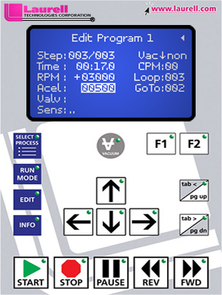

# Laurel Spinner

> [!WARNING] Preflight checks
> 
>| Utility         | Pressure     |
>|----------------:|--------------|
>| N2              | ~60 psi      |
>| Compressed Air  | ~80 psi      |
>| Vacuum          | 20-25 in. Hg |

Turn on the N2 and vacuum via the lever valves on the lefthand side of the fumehood

## Operation

The Laurel is mainly controlled via the panel on the righthand side of the tool:

1. Define process parameters with the `EDIT` button or use a predefined process using the `SELECT PROCESS` button.
2. Select an appropriate chuck. This means your sample should cover the O-ring from view entirely when loaded. We have a very small chuck in the group drawer. 
3. Center sample on the chuck and engage the vacuum with ~~`V`~~.
4. Close the lid and run the program with `START`
5. When the program is done, open the chamber, turn off the vacuum and remove the sample for baking.
6. Put on a second pair of gloves and wipe down the chamber with acetone. Clean the catch and the bench as well.
7. Put all solid waste into an appropriately labelled bag, stored in the fumehood.
8. Close the vacuum and N2 valves at the fumehood.